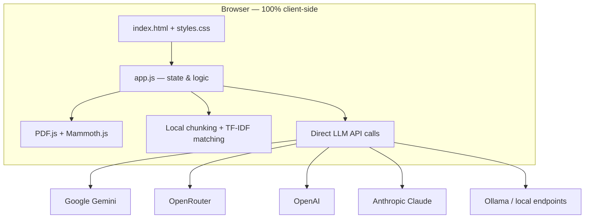
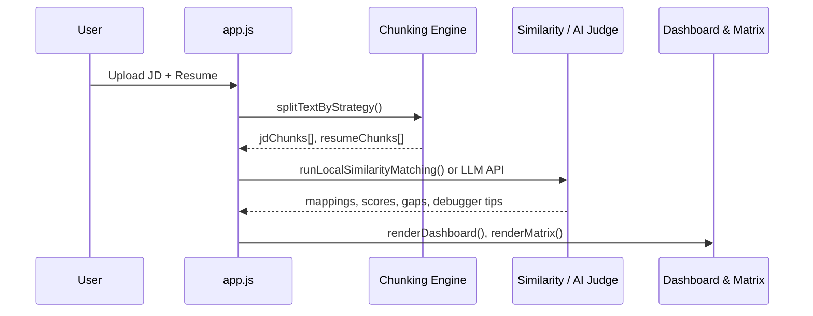

# ResuMatch ATS

A transparent, browser-based resume vs. job-description matching debugger. ResuMatch splits both documents into chunks the way ATS and recruiting pipelines often do, then scores alignment section-by-section so you can see gaps, tune chunking, and improve your resume before you apply.

**Live:** [resumematch.sourabhk.in](https://resumematch.sourabhk.in)

---

## What it does

ResuMatch helps job seekers understand how automated screening might evaluate their resume against a role:

1. **Upload or paste** a job description and resume (PDF, DOCX, or plain text).
2. **Chunk** both documents using configurable strategies (section-based, hybrid, fixed size, etc.).
3. **Match** resume chunks to JD chunks locally (TF-IDF / cosine) or with an **AI Judge** (your own API key).
4. **Review** a dashboard of category scores, gap analysis, chunk matrix, and rewrite suggestions.

Everything runs in your browser. Your resume, job description, and API key are never sent to a ResuMatch server.

---

## Architecture

ResuMatch is a **static single-page application** with no backend. There is no build step, no Node server, and no database.



### Design principles

| Principle | Implementation |
|-----------|----------------|
| **Privacy first** | Documents and API keys stay in `localStorage` / in-memory only |
| **Transparency** | Every chunk, mapping, and score is inspectable in the UI |
| **No vendor lock-in** | Bring your own key; switch providers and models freely |
| **Zero infra** | Static files deployed to Vercel (or any static host) |

### File structure

```
Resume_Match/
├── index.html      # App shell, sidebar controls, tab panes, API drawer
├── styles.css      # Layout, Windows-inspired UI, mobile breakpoints
├── app.js          # Chunking engine, matching, LLM calls, UI state
├── favicon.svg     # Brand icon
└── README.md       # This file
```

### Runtime dependencies (CDN)

- [Lucide](https://lucide.dev/) — icons
- [PDF.js](https://mozilla.github.io/pdf.js/) — client-side PDF text extraction
- [Mammoth.js](https://github.com/mwilliamson/mammoth.js) — DOCX text extraction
- Google Fonts — Inter, Outfit

---

## Application flow



### Workspace tabs

| Tab | Purpose |
|-----|---------|
| **Input Documents** | JD/resume upload, samples, run evaluation |
| **Chunk Playground** | Live chunk list, stats, manual chunk edits |
| **Match Dashboard** | Overall score, category bars, gap lists |
| **Alignment Matrix** | Resume ↔ JD chunk mappings with inspect panel |
| **Resume Debugger** | Suggested line rewrites |
| **How It Works** | Onboarding, chunking concepts, API key guide |

### Sidebar controls

- **Chunking strategy** — section, hybrid, paragraph, fixed, token, sentence, semantic
- **Chunk size / overlap** — for fixed, token, and hybrid strategies
- **Merge small chunks** — combine fragments below minimum length
- **Preserve headers** — keep section labels attached to chunks
- **Similarity method** — AI Judge (LLM) or local TF-IDF / cosine
- **Custom AI instructions** — optional prompt appended to all LLM system messages

---

## Chunking engine

The default **Section-Based** strategy mirrors how many ATS parsers treat resumes: split on headers like Experience, Skills, and Education.

| Strategy | Best for |
|----------|----------|
| **Section-Based** | Most resumes (recommended) |
| **Hybrid** | Long experience blocks with mixed formatting |
| **Paragraph** | Resumes without clear section labels |
| **Fixed / Token** | Experimenting with chunk size |
| **Sentence** | Very granular analysis (niche) |
| **Semantic** | Boundary detection via local Jaccard similarity (experimental) |

After splitting, optional post-processing merges chunks shorter than the configured minimum length.

---

## Matching modes

### Local (free, no API key)

- Tokenizes text, builds TF-IDF vectors, computes cosine similarity between resume and JD chunks
- Useful for exploring chunk boundaries and keyword overlap without cost

### AI Judge (requires API key)

Sends the full JD and resume to your chosen LLM with a structured JSON schema. Returns:

- Overall qualification score and level
- Category scores (skills, experience, tools, leadership, education, domain, keywords)
- Critical / important / nice-to-have gaps
- Chunk-level mappings with reasons and severity
- Debugger rewrite suggestions

Supported providers (configured in **API Settings**):

| Provider | Notes |
|----------|-------|
| **Google Gemini** | Recommended; works well from the browser; free tier available |
| **OpenRouter** | Single key for many models; good CORS story |
| **OpenAI** | Direct calls may fail in browser due to CORS |
| **Anthropic Claude** | Direct calls may fail in browser due to CORS |
| **Kimi (Moonshot)** | Moonshot API |
| **Custom** | Ollama, DeepSeek, or any OpenAI-compatible local endpoint |

Model names are auto-populated per provider in a dropdown when you switch providers.

---

## State & persistence

All persisted data is stored in the browser via `localStorage`:

| Key | Contents |
|-----|----------|
| `ats_api_key` | LLM API key |
| `ats_api_provider` | Selected provider |
| `ats_api_base_url` | API base URL |
| `ats_api_model` | Selected model |
| `ats_custom_prompt` | Custom AI instructions |
| `resumatch_banner_dismissed` | API key banner dismiss flag |

Resume and JD text are held in memory during the session only (unless pasted into textareas, which are not auto-saved).

---

## Local development

No install required. Serve the folder with any static file server:

```bash
cd Resume_Match
python3 -m http.server 8080
# open http://localhost:8080
```

Or open `index.html` directly in a browser (some CDN features work best over HTTP).

---

## Deployment

Hosted on **Vercel** as a static site (no build command).

```bash
vercel deploy --prod --yes --scope thefallenxjedis-projects
```

Custom domain: `resumematch.sourabhk.in` → Vercel (`cname.vercel-dns.com`).

---

## UI overview

- **Compact header** — logo, API status badge, settings
- **Collapsible sidebar** — intro, privacy callouts, chunking controls (drawer on mobile)
- **Responsive layout** — scrollable tabs, `100dvh` viewport, hamburger menu under 768px
- **JS tooltip portal** — help icons render above overflow containers (no clipping)

---

## Privacy

- ResuMatch does not operate a backend that receives your documents or API keys.
- LLM requests go **directly from your browser** to the provider you configure.
- You control your key; clear it anytime via **Reset Defaults** in API Settings.

---

## License

Personal project by [Sourabh K](https://sourabhk.in). Use and adapt freely; attribution appreciated.
